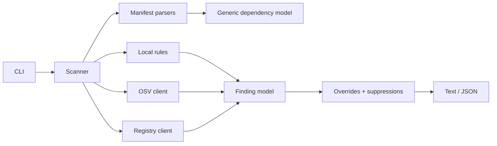

# Architecture

RepoDoctor follows one pipeline: collect local evidence, enrich package coordinates, apply policy, then render. Packages stay narrow so each boundary can be tested without a live service.

## Package responsibilities

- `cmd/repodoctor`: command/flag parsing, deadlines, output files, process exit codes.
- `internal/deps`: ecosystem-specific extraction into one dependency shape.
- `internal/rules`: local static repository, Git, script, secret, and source checks.
- `internal/advisory`: OSV batch transport and advisory classification.
- `internal/registry`: bounded concurrent npm/PyPI metadata enrichment and similarity logic.
- `internal/scan`: orchestration, modes, configuration, overrides, suppression, sorting.
- `internal/report`: deterministic human and JSON serializers.
- `internal/model`: stable public report vocabulary and finding catalog.

## Concurrency and cancellation

OSV uses one batch request for all exact versions. Registry checks are independent and run through five workers. The CLI places one context deadline around the scan; every network request inherits it. No rule launches an unbounded goroutine per dependency.

## Failure semantics

Local read/parse/configuration failures return exit code 3 because the scan is incomplete. OSV and registry outages do not discard local results: their status becomes `unavailable`. This distinction prevents both fail-open “safe” language and an unnecessarily empty report.

## Why one dependency

The CLI uses the Go standard library for commands, HTTP, JSON, filesystem work, and concurrency. `gopkg.in/yaml.v3` is the only runtime dependency because `.repodoctor.yml` is part of the user contract and a hand-written YAML parser would be unsafe and misleading.
