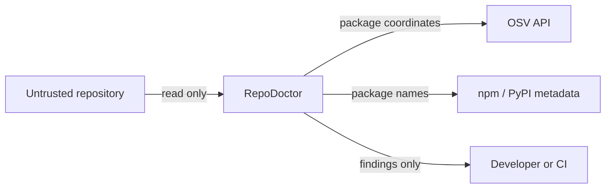

# Threat model

RepoDoctor is a pre-install static review tool. Its protected asset is the developer or CI environment that would otherwise grant trust to repository contents and declared dependencies without an initial inspection.

## Trust boundaries

Repository files begin untrusted. RepoDoctor reads bounded text files and parses data; it does not import, execute, install, or build the target. Network services are also untrusted inputs: responses are size-limited, decoded into fixed structures, and subject to request timeouts.

## Threats in scope

### Known vulnerable dependencies

An otherwise legitimate version may contain a published vulnerability. Exact resolved versions are sent to OSV. A mutable version range cannot produce an exact advisory answer, so RepoDoctor reports the missing pin instead of treating the range as safe.

### Known malicious packages or versions

OpenSSF Malicious Packages publishes reports using the OSV schema. RepoDoctor treats `MAL-*` records returned by OSV as authoritative evidence for `RD-SEC-002`. It does not maintain or silently age a copied malware list.

### Typosquatting

An attacker registers a name similar to a well-known package and waits for a misspelling. RepoDoctor combines public-registry existence with explainable edit distance. Similarity alone remains medium-confidence review guidance.

### Slopsquatting / package hallucination

A setup guide or coding assistant may invent a plausible package name. Registry absence is useful evidence that authenticity requires review, but absence can also mean a private registry or temporary outage. Lookup state is therefore reported separately.

### Compromised package versions

A real project can publish one compromised release. OSV/OpenSSF records may identify it if it is known; static coordinate matching cannot discover unpublished compromise. Exact lockfile versions improve the quality of this check.

### Install-time scripts

Lifecycle hooks can execute before application code. RepoDoctor inspects the target project's npm lifecycle commands for combinations such as network download, shell execution, decoding, and executable permission changes. It never runs the command or referenced file.

### Direct dependency sources

Git branches, arbitrary tarballs, and paths outside the repository may bypass normal registry review and can change without a version bump. RepoDoctor reports the source and recommends an immutable reviewed release or commit.

### Secret leakage

Tracked environment files and high-confidence credential patterns can expose accounts. Detection is entirely local. Reports keep only the type, location, and a short redacted preview. Revocation and history cleanup remain operator actions.

## Threats not solved

- A previously unknown vulnerability or malicious release with no public record.
- Malicious behavior hidden in package contents; archives are not downloaded.
- Registry or advisory compromise returning false metadata.
- Sophisticated secret formats outside the conservative pattern set.
- Build-system behavior that is not declared in inspected manifests/scripts.
- DNS/network interception between the host and public metadata APIs.
- A repository designed to exhaust disk or CPU beyond the scanner's current file and HTTP limits.

## Security properties

- Target repositories are not modified by scan commands.
- Files larger than 2 MiB and binary files are skipped by local content rules.
- Common dependency/build directories are not traversed.
- HTTP requests have deadlines; responses are capped at 4 MiB.
- Registry work uses a fixed worker count.
- Full suspected secret values are never placed in a finding.
- External lookup failure is represented as unknown/unavailable, not safe.

## Interpreting results

A clean report means no enabled rule found evidence within its stated limits. It does not prove safety. High-confidence advisory evidence deserves immediate action; medium-confidence authenticity findings deserve provenance review; health and quality findings describe repository controls rather than exploitable vulnerabilities.
